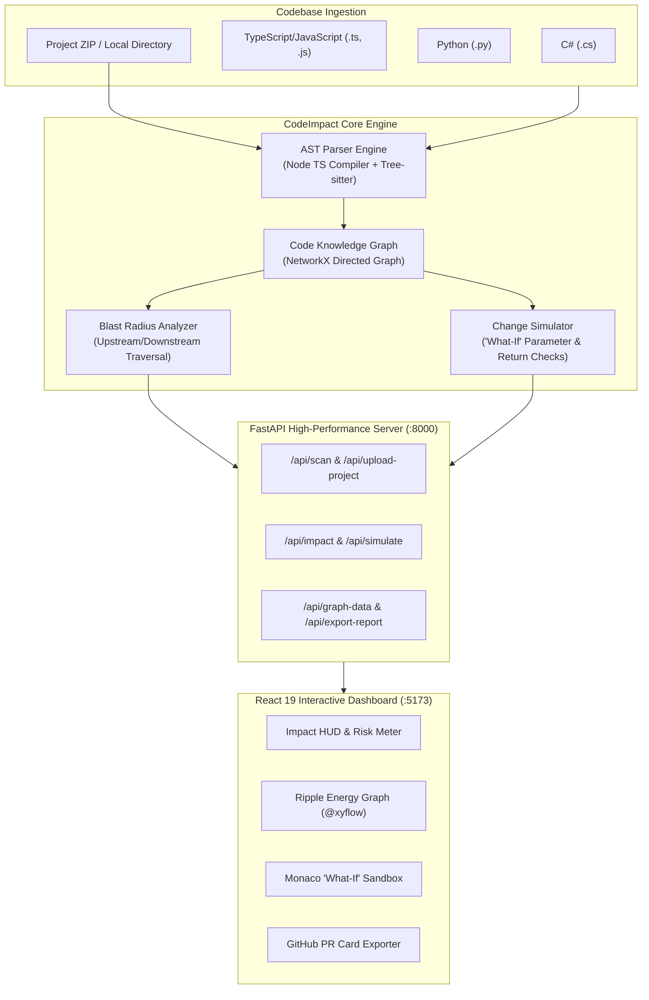

<p align="center">
  
</p>

<h1 align="center">CodeImpact</h1>

<p align="center">
  <strong>Intelligent Code Dependency &amp; Blast Radius Impact Analyzer</strong><br>
  <em>"If I change this function, what else could break?"</em>
</p>

<p align="center">
  
  
  
  
  
  
  
</p>

---

## 📖 Overview

**CodeImpact** is an AST-powered developer analysis platform that parses source code, constructs a **Code Knowledge Graph (CKG)**, and calculates the complete blast radius of modifying any function, method, or contract **before** deployment or code review.

It automatically identifies:
- 🔁 **Upstream Caller Cascade**: Direct and transitive callers affected by a code modification.
- 🌐 **External HTTP Endpoint Taint**: Public controllers and API routes exposed to breaking changes.
- 💾 **Database Operations in Call Path**: State mutations, queries, and ORM repository operations.
- 🧪 **Untested Danger Zones**: Critical execution paths that have zero unit test coverage.
- 🚨 **Breaking Signature Change Prediction**: Exact parameter count mismatches and type discrepancies across call sites.
- 🛠️ **"What-If" Simulation Sandbox**: Interactive Monaco Editor to experiment with signature changes and diagnose breaking callers live.

---

## 🌟 Key Features

### 🔍 Multi-Language AST Engine
- **C# (`.cs`)**: Classes, methods, namespaces, parameters, return types, ASP.NET Core controller routing (`[HttpGet]`, `[HttpPost]`), database attributes, and unit tests.
- **TypeScript & JavaScript (`.ts`, `.tsx`, `.js`, `.jsx`)**: High-performance Node.js TypeScript Compiler AST parser + crash-resilient Tree-sitter fallback. Extracts arrow functions (`const fn = () => ...`), function expressions, class property methods, return type annotations, and nested call sites.
- **Python (`.py`)**: Classes, functions, parameters, PyTest/unittest test discovery, and call hierarchy resolution.

### ⚡ Blast Radius & Risk Scorer (0–100)
Every symbol is scored across four weighted dimensions:
$$\text{Blast Score} = \min(100, \text{Fan-Out (35pts)} + \text{Controllers (30pts)} + \text{Database (20pts)} + \text{Untested Penalty (15pts)})$$
- 🔴 **`CRITICAL`** ($\ge 75$): Extensive API endpoint exposure or deep database mutations.
- 🟠 **`HIGH`** ($50 - 74$): Multiple controllers or intermediate services affected.
- 🟡 **`MEDIUM`** ($25 - 49$): Contained service caller chain.
- 🟢 **`LOW`** ($< 25$): Isolated footprint with high test coverage.

### 📊 Interactive Ripple Energy Graph (`@xyflow/react`)
- Force-directed topological view organized into 4 layered tiers: **Controllers/Tests $\rightarrow$ Callers $\rightarrow$ Target $\rightarrow$ Repositories**.
- Animated energy packet ripple pulses propagating along the blast radius path.
- Minimap, zoom controls, and custom node telemetry cards.

### 🛠️ "What-If" Code Sandbox (Monaco Editor)
- Side-by-side Monaco editor displaying the target symbol's source code.
- Interactive virtual signature modifier: add/remove parameters, specify types, default values, and experimental return types.
- Live compiler breaking-change diagnostics identifying exact breaking call sites with line numbers and recommended fixes.

### 📦 Direct Project Upload & Local Scanning
- **Drag-and-Drop `.zip` Upload**: Safely extracts and analyzes project archives with path traversal guards.
- **Local Directory Scanning**: Enter any machine path (e.g. `D:\projects\my-service`) for instant AST parsing.
- **Project Deduplication**: Auto-detects dominant language and prevents duplicate dropdown entries.

### 📋 1-Click GitHub PR Blast Radius Card
- Generates formatted GitHub-flavored markdown summaries with risk badges, impact metric tables, and affected endpoint lists.
- 1-click clipboard copy and full JSON audit report download for CI/CD pipeline integration.

---

## 🏗️ Architecture



---

## 🚀 How to Run the Project

### Prerequisites

Ensure you have the following installed:
- **Python 3.10+** (Tested on Python 3.12)
- **Node.js 18+** (Tested on Node.js 20+)
- **Git**

---

### Step 1: Clone Repository

```bash
git clone https://github.com/Humaam-04-06/CodeImpact.git
cd CodeImpact
```

---

### Step 2: Backend Setup & Launch

#### On Windows (PowerShell):
```powershell
# 1. Create Python virtual environment
python -m venv backend\venv

# 2. Activate virtual environment
backend\venv\Scripts\activate

# 3. Install backend dependencies
pip install -r backend\requirements.txt

# 4. Start the FastAPI backend server
python -m uvicorn backend.main:app --port 8000 --reload
```

#### On macOS / Linux:
```bash
# 1. Create Python virtual environment
python3 -m venv backend/venv

# 2. Activate virtual environment
source backend/venv/bin/activate

# 3. Install backend dependencies
pip install -r backend/requirements.txt

# 4. Start the FastAPI backend server
python3 -m uvicorn backend.main:app --port 8000 --reload
```

> 🌐 **Backend API Documentation**: Open [http://127.0.0.1:8000/docs](http://127.0.0.1:8000/docs) in your browser for interactive Swagger API documentation.

---

### Step 3: Frontend Setup & Launch

Open a **new terminal window**:

```bash
# 1. Navigate to frontend directory
cd frontend

# 2. Install frontend dependencies
npm install

# 3. Start Vite development server
npm run dev
```

> ⚡ **Frontend Application**: Open [http://localhost:5173](http://localhost:5173) in your browser to launch the CodeImpact Dashboard!

---

## 🧪 Automated Testing & Verification

CodeImpact includes a comprehensive automated test suite covering all AST parsers, knowledge graph construction, blast radius formulas, "what-if" simulations, and API endpoints.

### Run Backend Tests (23 Passing Tests):

```powershell
# From the project root
backend\venv\Scripts\pytest backend/tests/ -v
```

```
============================= test session starts =============================
platform win32 -- Python 3.12.10, pytest-9.1.1
collected 23 items

backend/tests/test_api_endpoints.py::test_health PASSED                  [  4%]
backend/tests/test_api_endpoints.py::test_samples PASSED                 [  8%]
backend/tests/test_api_endpoints.py::test_scan_and_symbols PASSED        [ 13%]
backend/tests/test_api_endpoints.py::test_impact_analysis PASSED         [ 17%]
backend/tests/test_api_endpoints.py::test_simulate_change PASSED         [ 21%]
backend/tests/test_api_endpoints.py::test_graph_data PASSED              [ 26%]
backend/tests/test_api_endpoints.py::test_export_report PASSED           [ 30%]
backend/tests/test_api_endpoints.py::test_ts_saas_scan PASSED            [ 34%]
backend/tests/test_api_endpoints.py::test_upload_project_zip PASSED      [ 39%]
backend/tests/test_api_endpoints.py::test_upload_invalid_file PASSED     [ 43%]
backend/tests/test_api_endpoints.py::test_upload_deduplication_and_multiple_projects PASSED [ 47%]
backend/tests/test_api_endpoints.py::test_js_ts_arrow_functions_and_return_types PASSED [ 52%]
backend/tests/test_impact.py::test_csharp_parser_accuracy PASSED         [ 56%]
backend/tests/test_impact.py::test_typescript_parser_accuracy PASSED     [ 60%]
backend/tests/test_impact.py::test_python_parser_accuracy PASSED         [ 65%]
backend/tests/test_impact.py::test_graph_construction_and_cross_file_resolution PASSED [ 69%]
backend/tests/test_impact.py::test_graph_cycles_resilience PASSED        [ 73%]
backend/tests/test_impact.py::test_disconnected_components PASSED        [ 78%]
backend/tests/test_impact.py::test_user_service_get_user_exact_metrics PASSED [ 82%]
backend/tests/test_impact.py::test_change_simulation_add_required_parameter PASSED [ 86%]
backend/tests/test_impact.py::test_change_simulation_optional_parameter_no_breaking PASSED [ 91%]
backend/tests/test_impact.py::test_change_simulation_return_type_mismatch PASSED [ 95%]
backend/tests/test_impact.py::test_markdown_report_formatting PASSED     [100%]

======================= 23 passed, 2 warnings in 1.52s ========================
```

### Run Frontend Production Build:

```powershell
cd frontend
npm run build
```
- **TypeScript compilation (`tsc -b`)**: 0 errors.
- **Production bundle**: Built in `<400ms`.

---

## 📂 Preloaded Sample Projects

CodeImpact includes 3 realistic enterprise sample codebases out of the box:

| Project | Language | Architecture & Files |
| :--- | :--- | :--- |
| **C# E-Commerce Microservice** | C# (`.cs`) | `UserService`, `OrderService`, `PaymentService`, `AuthController`, `OrderController`, `UserRepository`, `UserServiceTests` |
| **TypeScript Cloud Billing SaaS** | TypeScript (`.ts`) | `SubscriptionService`, `BillingController`, `PaymentGateway`, unit tests |
| **Python AI Sentiment Service** | Python (`.py`) | `ModelService`, `ApiController`, `DbLogger`, `test_model` |

### 🎯 Benchmark Verification Scenario:
Select **`UserService.GetUser(string userId)`** in the dropdown:
- **7 Dependent Callers**: `UpdateUserProfile`, `ChangePassword`, `ProcessPayment`, `PlaceOrder`, `AuthController.Login`, `OrderController.Create`, `UserController.GetProfile`
- **3 Public Controllers**: `AuthController`, `OrderController`, `UserController`
- **2 Database Operations**: `FindByIdAsync`, `UpdateLastLoginAsync`
- **1 Unit Test**: `UserServiceTests.TestGetUser`
- **Untested Danger Zones Flagged**: `ProcessPayment`, `PlaceOrder`, `ChangePassword`
- **Blast Score**: **`55 / 100`** $\rightarrow$ `HIGH RISK`

---

## 📁 Repository Structure

```
Dependency_Impact_Analyzer/
├── backend/
│   ├── engine/
│   │   ├── change_simulator.py      # "What-If" contract change simulator
│   │   ├── graph_builder.py         # NetworkX Code Knowledge Graph constructor
│   │   ├── impact_analyzer.py       # Blast radius, danger zones & scoring engine
│   │   ├── js_ts_ast_parser.js      # High-performance Node.js AST parser for JS/TS
│   │   ├── models.py                # Pydantic schemas (SymbolNode, BlastReport, etc.)
│   │   └── parser_engine.py         # Multi-language AST engine (C#, JS/TS, Python)
│   ├── tests/
│   │   ├── test_api_endpoints.py    # FastAPI endpoint & upload integration tests
│   │   └── test_impact.py           # AST parser precision & graph algorithm tests
│   ├── main.py                      # FastAPI application & REST endpoints
│   └── requirements.txt             # Backend Python dependencies
├── frontend/
│   ├── public/
│   │   ├── favicon.svg              # Custom browser tab icon
│   │   ├── logo.png                 # Brand logo image (high-res)
│   │   └── logo.svg                 # Scalable vector brand logo
│   ├── src/
│   │   ├── components/
│   │   │   ├── CodeSandbox.tsx      # Monaco editor & "What-If" simulator UI
│   │   │   ├── CustomEdges.tsx      # Animated SVG ripple energy edges
│   │   │   ├── CustomNodes.tsx      # Custom React Flow symbol nodes
│   │   │   ├── GraphView.tsx        # React Flow graph canvas & minimap
│   │   │   ├── ImpactHUD.tsx        # Blast radius score gauge & metric cards
│   │   │   ├── Navbar.tsx           # Workspace selector & project upload trigger
│   │   │   ├── PRReportModal.tsx    # GitHub PR Blast Radius card exporter
│   │   │   ├── Sidebar.tsx          # Symbol tree navigator & filter pills
│   │   │   └── UploadProjectModal.tsx # ZIP dropzone & local path scanner
│   │   ├── services/api.ts          # Strongly-typed backend API client
│   │   ├── types/impact.ts          # TypeScript interfaces matching backend models
│   │   ├── utils/icons.ts           # FontAwesome icon catalog
│   │   ├── App.tsx                  # Main application orchestrator
│   │   ├── index.css                # Tailwind CSS v4 styling & dark theme
│   │   └── main.tsx                 # React DOM entry point
│   ├── package.json                 # Frontend dependencies & scripts
│   └── vite.config.ts               # Vite configuration with proxy to port 8000
├── sample_projects/                 # Enterprise sample codebases (C#, TS, Python)
├── pytest.ini                       # Pytest configuration
└── README.md                        # Documentation & setup guide
```

---

## 🛠️ Technology Stack

| Layer | Technologies |
| :--- | :--- |
| **Backend** | Python 3.12, FastAPI, Uvicorn, Pydantic v2, NetworkX (Graph Theory), Tree-sitter, Pytest |
| **Frontend** | React 19, TypeScript 6, Vite 8, Tailwind CSS v4, Monaco Editor (`@monaco-editor/react`), React Flow (`@xyflow/react`) |
| **Icons & Design** | FontAwesome (`@fortawesome/react-fontawesome`), JetBrains Mono, Inter |
| **Parsing** | Node.js TypeScript Compiler AST (`typescript`) + Tree-sitter (C#, Python) |

---

## 📄 License

This project is licensed under the **MIT License** — see the [LICENSE](LICENSE) file for details.
